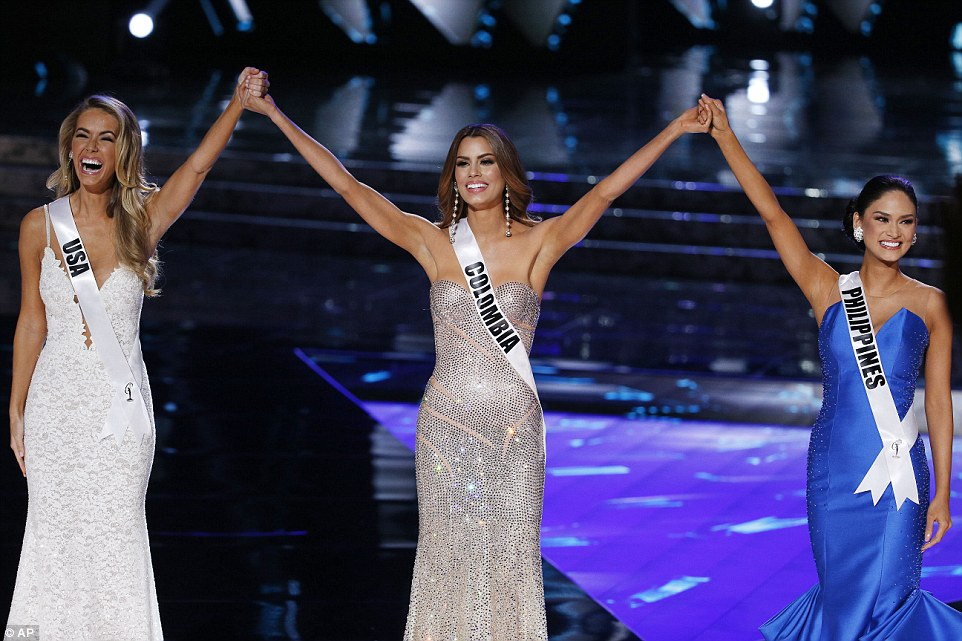
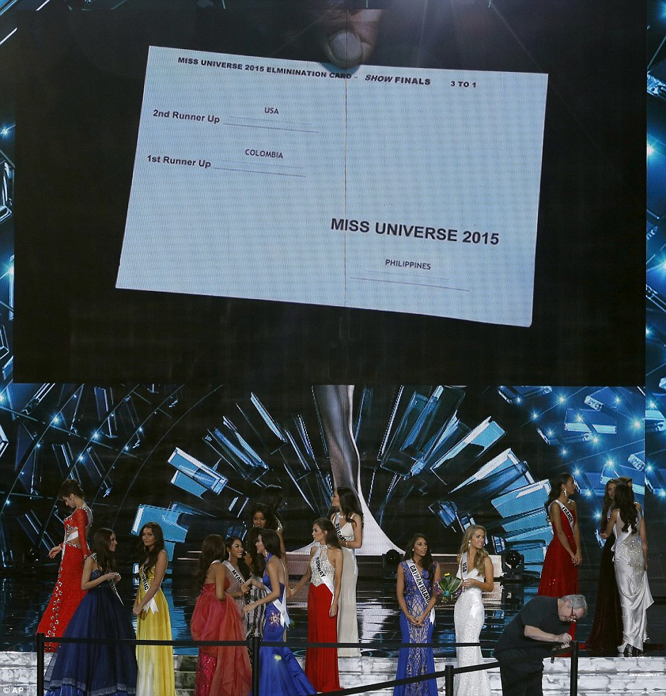
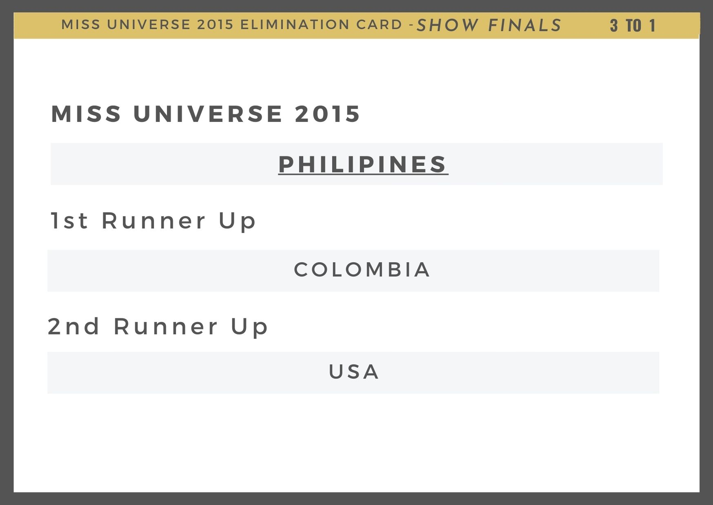

# HCI-TeamL

## Insiden Steve Harvey Salah Menyebutkan Nama Pemenang Miss Universe 2015
Sebelum kami menjelaskan mengenai mengapa insiden ini terjadi, kami akan sedikit lebih dulu menerangkan acara perhelatan ini. Miss Universe 2015 adalah penyelenggaraan kontes kecantikan tingkat dunia untuk ke-67 yang diselenggarakan pada 20 Desember 2015 di The Axis Planet Hollywood Resort & Casino, Las Vegas, Nevada, Amerika Serikat. Acara ini diikuti oleh 80 peserta dari berbagai negara.  

Link Artikel : https://www.dailymail.co.uk/news/article-3368439/Disaster-strikes-Miss-Universe-2015-Steve-Harvey-announces-WRONG-winner.html

## Penyebab
Insiden ini bermula ketika FInalis Miss Universe 2015 tersisa tiga peserta Pia Alonzo Wurtzbach (Filipina), Ariadna Gutiérrez (Kolombia) dan Olivia Jordan (Amerika Serikat) yang akan merebutkan gelar sebagai Miss Universe 2015. Kemudian Steve Harvey mengumumkan pemenang 2nd Runner Up Miss Universe 2015 jatuh kepada Amerika Serikat (Olivia Jordan). Maka tersisa dua peserta Filipina dan Kolombia, dan selanjutnya Steve Harvey mengumumkan bahwa Ariadna Gutiérrez (Kolombia) sebagai Miss Universe 2015. Kemudian Miss Universe 2014, Paulina Vega dari Kolombia memahkotai Ariadna Gutiérrez (Kolombia) sebagai Miss Universe 2015.  

Namun setelah itu pembawa acara Steve Harvey kembali ke atas panggung dan meminta maaf bahwa dia salah menyebutkan nama pemenang. Steve Harvey mengumumkan bahwa Ariadna Gutiérrez (Kolombia) dinobatkan sebagai 1st Runner Up Miss Universe 2015. Dan menetapkan Pia Alonzo Wurtzbach (Filipina) sebagai Miss Universe 2015 yang kemudian dimahkotai oleh Paulina Vega  

Setelah Pia Wurtzbach (Filipina) dimahkotai, Steve Harvey mengambil alih acara dan menjelaskan bahwa ia mengakui kesalahannya yang sangat fatal tersebut. Steve menerangkan bahwa jelas tertulis di Kartu yang ia pegang Miss Universe 2015 jatuh kepada Filipina. Steve menerima segala konsekuensi atas kesalahanya.  

## Kesalahan Desain

Terlihat jelas pada gambar dibawah, bahwa desain kartu dibawah buruk dan sangat ambigu sehingga menyebabkan kesalahan. Karena desain kartu kurang enak dipandang dan banyak keganjilan pada kartu tersebut. Steve Harvey mengakui bahwa tulisan pemenang Miss Universe 2015 sempat tertutup oleh ibu jarinya sebab berada di bawah kartu, oleh karena itu Steve berfikir Miss Kolombia lah yang menjadi Miss Universe 2015. Steve merasa sangat bertanggung jawab atas kesalahan ini, tetapi kami Team L menilai bahwa desain yang buruk pada kartu eliminasi ini yang merupakan penyebab utama kesalahan yang membuat Miss Kolombia dipermalukan didepan jutaan penonton.  
Kesalahan Disebabkan : 
- Font tulisan pada desain kartu terlalu kecil hal ini dapat menyulitkan pembawa acara
- Tulisan nama finalis (PHILIPINES), (COLOMBIA) dan (USA) terbuat dari stiker yang di tempel pada kartu, bisa saja terindikasi kecurangan pada kartu eliminasi
- Tulisan "MISS UNIVERSE 2015" yang terletak pada pojok kanan bawah menjadikanya seakan akan tidak terlihat
- Susunan urutan pemenang dari bawah ke atas tampak ambigu, karena pemenang 

## Perbaikan Desain

- Visual kartu dibuat lebih mudah dilihat agar pembawa acara bisa dengan mudah mengetahui apa isi kartu
- Perbedaan tata letak dan urutan kami lakukan agar tidak ada ketaksaan atau ambiguitas pada kartu eliminasi
- Memperbesar font agar mudah dibaca oleh pembawa acara
- Kartu eliminasi dicetak bersamaan dengan nama pemenang

## Revisi User Interface

