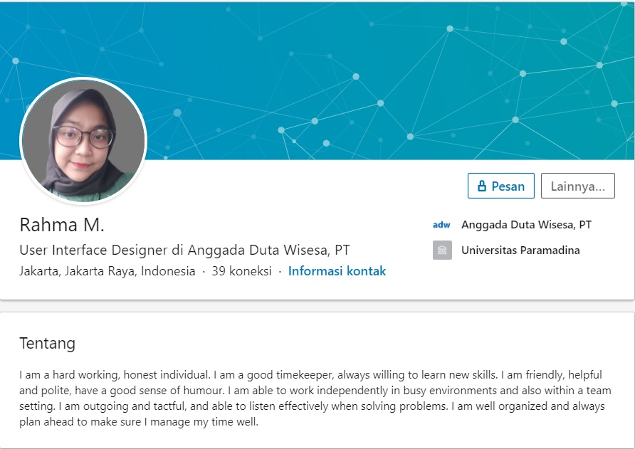
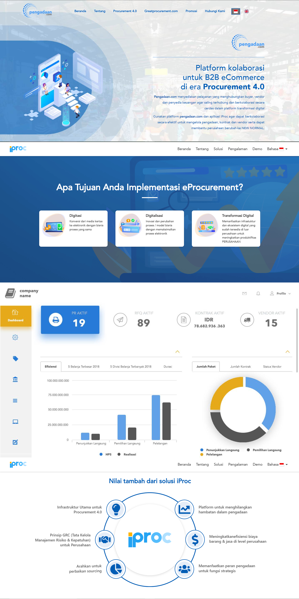

# WAWANCARA
## Narasumber : Rahma Maulidya  

Sudah berapa lama kak Rahma berprofesi menjadi seorang UX Designer kak?

  **"Koreksi sedikit kebetulan aku UI Designer, untuk pekerjaan terkait UXnya hanya 40% aja selama ini. Aku kebetulan udah jadi UX kurang lebih 2 tahun"**  

Hal apa nih kak, yang membuat kaka tertarik dengan UX ?

**"Sebenernya simpel sih, UX itu kan tentang gimana kita bisa mendesain flow sesuatu agar lebih friendly ke user. saya suka aja sihh nebak nebak dan nyusun flow yang masih berantakan"**  

Sudah berapa aplikasi atau web yang pernah kak Rahma buat?

**"Kalo untuk aplikasi sendiri kebagi-bagi. Mock up aplikasi untuk tugas kuliah pernah, untuk kebutuhan lomba dari kantor juga pernah. Diluar pekerjaan sih udah pernah desain untuk kebutuhan aplikasi kurang lebih 3 ya. kalo web (freelancer) pernah 2 kali. Kalo dalam lingkup pekerjaan, wah kayanya hampir semua aplikasi dan website di kantor saya yg desain semua kayanya"**  

Kesulitan apa nih yang kak Rahma hadapin saat berkutat deengan UX ka?

**"somehow, mindmap yg kita implementasikan belum tentu akurat 100% sama dampaknya ke user. kadang yang menurut kita udah tepat flownya, malah user kesulitan. jadi kadang modernisasi nya sendiri sih yang bikin saya kesulitan nyeimbangin antara kemauan user dan kebutuhan industri kedepan"**  

Berarti apakah seorang UX designer harus mengikuti perkembangan jaman ?

**"exactly, mungkin beberapa bagian kita butuh andil masa lalu, tapi beberapa bagian juga kita harus coba terapkan keberadaan teknologi masa kini"**  

berarti ga semua harus menggunakan teknolgi yang baru ya ka?

**"betul. ga semua mesti terbaru, tapi atleast mempertahankan agar ga ketinggalan jaman aja somehow"**  

dan berarti juga sebelum kaka membuat desain UI/UX kaka melakukan analisa pasar dulu ya kak?

**"iya betul banget, aku mesti tau latar belakang perusahaan atau bisnis yg client jalankan. termasuk aku pun mesti tau kenapa mereka memutuskan menjadikan salah satu warna misal warna A sebagai coorporate brandingnya, gitu"**  

terus kak kan seorang desainer itu bisa disebut sebagai artist ya kak. dan biasanya seorang artist itu kan punya filosofi ditiap karyanya. kalau kak Rahma filosofi seperti apa yang kakak gunakan di tiap karya kak?

**"ini relate sama yang aku bahas tentang lakar belakang tadi sih, aku harus tau dulu kemauan klien itu seperti apa. dengan gitu, aku baru bisa ciptain filosofi/makna dari desain yang aku buatin untuk projek mereka"**  

kak berartii, filosofi yang kakak pakai itu kearah idealis dari Klien kaka ya kak?

**"kalo untuk kebutuhan pekerjaan, aku terpaksa harus jawab iya :) hehe krn memang gt.. tp kalo untuk diluar pekerjaan, filosofi aku sih asal aku merasa nyaman ngeliat tampilan ataupun flow yang aku buat, aku akan tetap lanjut sambil mikirin fungsional yang baiknyaa"**  

dikondisikan sesuai kebutuhan ya kak berarti

**"betul.. kdg idealis pribadi seorang designer harus  dikesampingkan atau bahasa kasarnya "dikorbankan" ketika memutuskan untuk terikat dengan sebuah coorporate yg professional"**  

terakhir nih kak saya boleh minta tips dan tricks nya kak untuk memulai menjadi seorang UI/UX Designer ?

**"tips dan trik ya.."** 
**"intinya sih gini, ketika profesi UI&UX hanya untuk pekerjaan sampingan dan sumber idealis kita pribadi, kita 'hanya' perlu mau tau tentang segala hal baru. misalnya setiap tahunnya kita tau ada yang namanya new year new branding. kita 'hanya' perlu eksplor and thats it. kita tau. dan kita nantinya ga akan kaku dengan hal itu.**  

**"beda cerita kalo profesi ui&ux merupakan profesi primary atau main job kita. kita 'harus' mau tau tntg segala hal baru. even kita ga suka sama hal baru itu. paksa diri kita untuk mau tau. kita 'harus' eksplor and ga berenti disitu, dengan eksplor berarti kita juga harus tau seluk beluk yg sdg kita eksplor. karena tanggung jawab profesi UI&UX dari dua perspektif (side job dan main job) itu sangat berbeda."**  

**"intinya, jangan males dan jangan gampang bosen untuk eksplor hal baru, ilmu baru. dan juga pernah sungkan untuk terbuka sama saran, kritik, dan masukkan dari orang sekitar"**
 

## Portofolio Narasumber

Link narahubung kak Rahma : https://www.linkedin.com/in/rahmaulidyaa/

