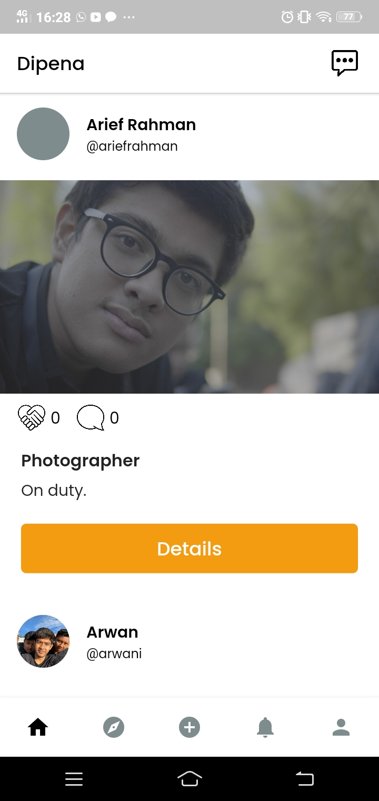

# Tugas 1

## ALASAN MENGAPA APLIKASI DIPENA TIDAK MENYENANGKAN
 

### Sekilas tentang Dipena

 
Dipena merupakan social network untuk seorang desainer, photographer, pelukis dan penggiat seni lainnya untuk kegiatan berbisnis.  
Pada Aplikasi ini seorang pengguna bisa mengambil keputusan / membuat keputusan dengan seseorang ditiap _postingan_ dalam Dipena.  
Jadi sesuai Dipena berharap bisa menjadi jembatan antara penggiat seni dan seorang pelanggan yang membutuhkan jasa seniman.  

_Share what you could or take what you should and change the world._
 

**Whoever you are, make your mom proud**  

### Pertama  

  

Pada halaman ini terlihat jelas bahwa developer Aplikasi Dipena tidak menerapkan konsistensi dalam bahasa yang digunakan.  Ini merupakan hal epele, namun nyatanya hal ini bisa berakibat fatal  jika seorang user yang sedang menggunakan aplikasi ini merupakan _native english speaker_. Hal tersebut menjadi salah satu aplikasi ini kurang dalam kontrol interaksinya.    

### Kedua  

  

Pada fitur _Logut Button_ ini sangat tidak nyaman menyenangkan karena ketika seorang user ingin keluar dari aplikasi ini langsung kembali pada laman login, tidak ada _pop up_ atau pun _alert_ yang berfungsi untuk meminimalisir seorang user tidak sengaja memencet tombol tersebut. Karena apabila seorang user dengan ketidaksengajaan terpencet tombol tersebut maka langsung kembali pada laman login.    

### Ketiga  

  

Pada fitur _folllowing_ ini terdapat interaksi yang error, yaitu ketika seorang user sudah memiliki mengikuti user lain itu tidak muncul pada fitur ini. Ini menjadi suatu hal yang menjengkelkan apabila user ingin mengetahui sudah mengikuti siapa saja, namun tidak muncul. Hal ini perlu di perbaiki oleh developer Dipena.  

### Keempat  

  

Pada laman ini sangat tidak nyaman untuk dilihat, karena chat bertumpuk walaupun hanya berbeda satuan detik. Dan chat yang sudah bertumpuk juga tidak dapat dihapus, ini sangat mengganggu dan membuat bingung seorang user, ketika sedang menggunakan fitur chat pada aplikasi ini.  

### Kelima  

  

Pada laman notifikasi ini terdapat kontrol yang error karena seorang user sama sekali tidak mendapatkan pemberitahuan dari aplikasi apabila ada yang memngikuti akun user atau mengajak kolaborasi. Ini merupakan kesalahan interaksi yang cukup fatal pada aplikasi ini, karena notifikasi merupakan bagian penting dari sebuah sistem yang ada pada _social platform_.
 
### Keenam  

  

Ketika seorang user ingin melihat foto pengguna lain di aplikasi Dipena ini bisa dengan cara mengklik foto pada laman ekplor, maka tampilan akan seperti pada gambar diatas. Pada laman ini seorang user bisa melakukan beberapa interaksi seberti memberikan komentar pada foto atau membuat kesepakantan dengan pengguna lain dengan fitur _collabs_. Namun pada fitur _collabs_ terjadi kesalahan. Ya ketika seorang user sudah di _collabs_ dengan user lain, seharusnya ikon berjabat tangan namun terjadi kesalahan sehingga ikon tersebut tidak bertambah jumlah angka pada ikon berjabat tangan.
