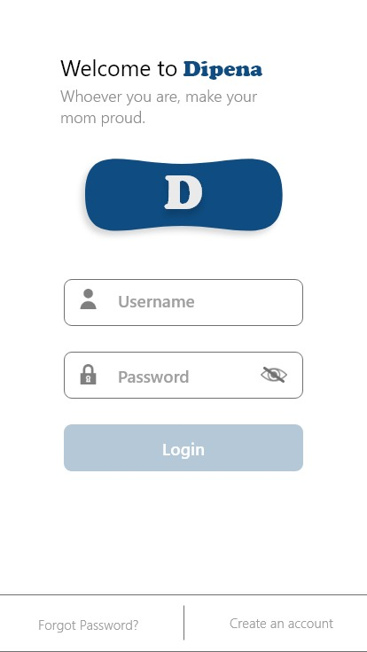
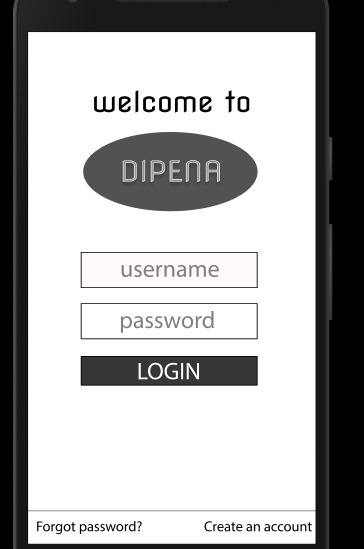

# Tugas 2:

# Hari 1
Pada hari ke-1, kami membahas tentang mengapa aplikasi mengalami masalah. Dan kami telah menemukan hal yang akan kami evaluasi. Hal tersebut adalah tentang :

HOME  
-Bahasa yang digunakan tidak konsisten  
-Following dan Followers tidak muncul  
-Logout tidak muncul alert  
-Bisa collabs sama diri sendiri  

NOTIFIKASI  
-Tidak muncul notif sama sekali  

ADD  
-Tidak bisa Multiple post  
-Tidak ada koneksi buat share ke aplikasi lain  

EKSPLOR  
-Saat Collabs tidak ada alert terlebih dahulu  
-Tidak ada fiture archive  

HOME  
-Icon berjabat tangan tidak bertambah meski sudah collabs  

CHAT  
-chat menumpuk atau berantakan  

Diskusi ini dilaksanakan pada hari Rabu, 7 Oktober 2020.

# Hari 2
Pada Hari ke-2, dua anggota tim kami bekerja untuk bersaing membuat desain dengan prinsip desain material  

DESIGN 1 <a href="https://xd.adobe.com/view/9ce883b9-6d9b-4605-a7aa-2f0c0b5f3c82-c9bb/">Klik di sini untuk detail desain.</a>  

  

DESIGN 2 <a href="https://www.figma.com/file/L1BS9z2kmrjPWxWAnHITs8/tugas-hci?node-id=15%3A27">Klik di sini untuk detail desain.</a>  

  

