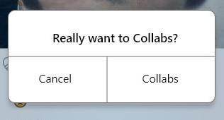
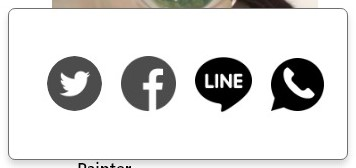
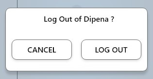

# Tugas 2:

# Hari 1
Pada hari ke-1, kami membahas tentang mengapa aplikasi mengalami masalah. Dan kami telah menemukan hal yang akan kami evaluasi. Hal tersebut adalah tentang :

HOME  
-Bahasa yang digunakan tidak konsisten  
-Following dan Followers tidak muncul  
-Logout tidak muncul alert  
-Bisa collabs sama diri sendiri  

NOTIFIKASI  
-Tidak muncul notif sama sekali  

ADD  
-Tidak bisa Multiple post  
-Tidak ada koneksi buat share ke aplikasi lain  

EKSPLOR  
-Saat Collabs tidak ada alert terlebih dahulu  
-Tidak ada fiture archive  

HOME  
-Icon berjabat tangan tidak bertambah meski sudah collabs  

CHAT  
-chat menumpuk atau berantakan  

Diskusi ini dilaksanakan pada hari Rabu, 7 Oktober 2020.

# Hari 2
Pada Hari ke-2, dua anggota tim kami bekerja untuk bersaing membuat desain dengan prinsip desain material  

DESIGN 1 <a href="https://xd.adobe.com/view/9ce883b9-6d9b-4605-a7aa-2f0c0b5f3c82-c9bb/">Klik di sini untuk detail desain.</a>  

  

DESIGN 2 <a href="https://www.figma.com/file/L1BS9z2kmrjPWxWAnHITs8/tugas-hci?node-id=15%3A27">Klik di sini untuk detail desain.</a>  

  

 Dilaksanakan pada hari Kamis, 8 Oktober 2020.
 
 
 # Hari 3
Pada Hari ke-3, kami mengadakan pertemuan virtual. Ada dua anggota tim kami yang menjelaskan tentang desain yang telah mereka buat masing-masing. Dan kami juga memilih dengan melibatkan 3 orang dari tim lain untuk memilih design mana yang bagus di gunakan.  

-<a href="https://youtu.be/o0sdShefGB8">Video tersebut dapat dilihat di sini.</a>  
 
 ini adalah desain yang terpilih <a href="https://xd.adobe.com/view/9ce883b9-6d9b-4605-a7aa-2f0c0b5f3c82-c9bb/">Klik di sini untuk detail desain.</a>  
 
   
 
Pertemuan ini dilaksanakan pada hari Jum'at, 9 Oktober 2020.

# Hari 4
Di Hari ke-4, kami mengadakan pertemuan virtual dengan pengembang. kami menjelaskan tentang mengapa desain kami diperlukan. Dan pengembang memberi kami sedikit umpan balik.

-<a href="https://youtu.be/cHwkThgny-E">Video tersebut dapat dilihat di sini.</a>  

Pertemuan ini dilaksanakan pada hari Sabtu, 10 Oktober 2020.  

**Penjelasan Pemanfaatan Desain Material**

  
1. Disini kami menambahkan pemberitahuan yang muncul, untuk menghapus atau membatalkan penghapusan.  

  
2. Disini kami menambahkan pemberitahuan yang muncul, untuk collabs atau membatalkan collabs.  

  
3. Disini kami menambahkan fitur berbagi atau share ke berbagai macam aplikasi sosial.

  
4. Disini kami menambahkan pemberitahuan yang muncul, untuk keluar dari akun atau batal untuk keluar dari akun.

 
 

