# Dikoin
  Tidak bisanya mengatur keuangan dengan baik sehingga akan memicu masalah keuangan yang berhubungan dengan keseharian. Ini tidak ada hubungannya dengan orang kaya atau miskin, tetapi bagaimana seseorang bisa mengelola keuangan pribadi maupun keluarganya dengan baik dan jelas. 
  
  Masalah keuangan ini sangat perlu diberikan edukasi, karena jika dibiarkan akan berdampak pada kondisi yang tidak kondusif. Project Dicoin ini adalah usaha kami untuk menghilangkan masalah ini. Dalam project ini kami berencana untuk membantu Anda dalam mengurus masalah keuangan agar mampu mengatur keuangan lebih baik.  

## Grafik
### Hasil Survei
  
  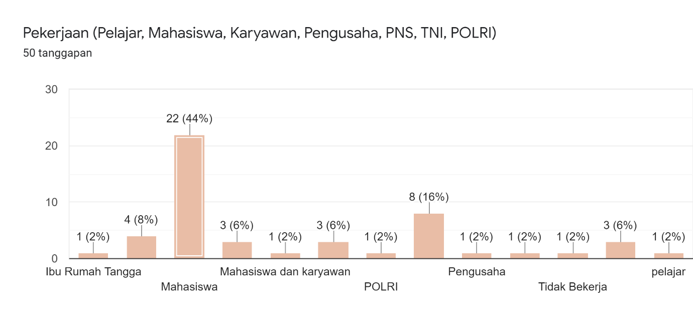
  
  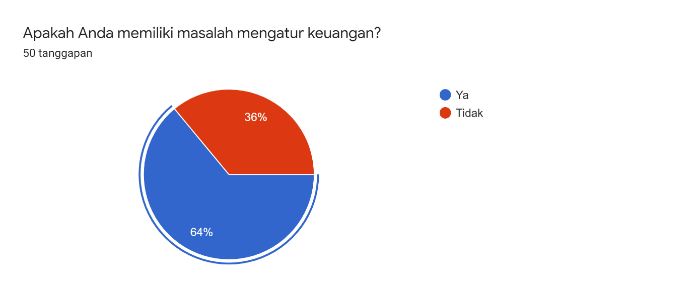
  
  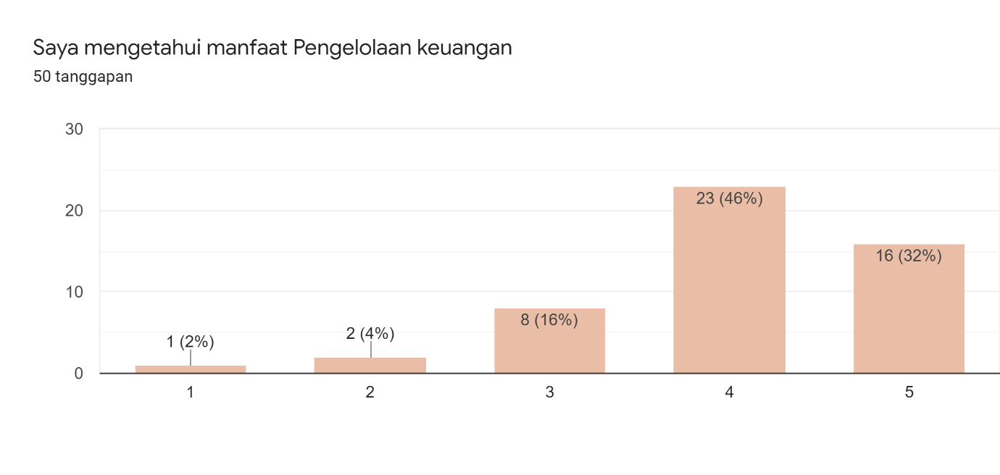
  
  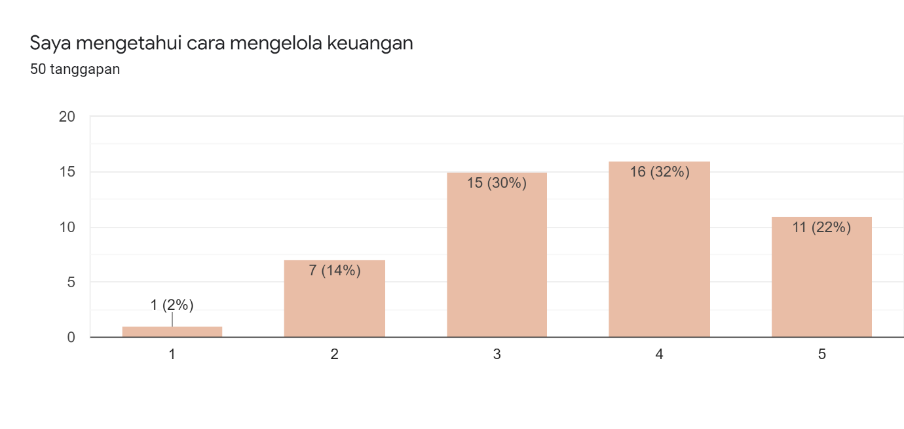
  
  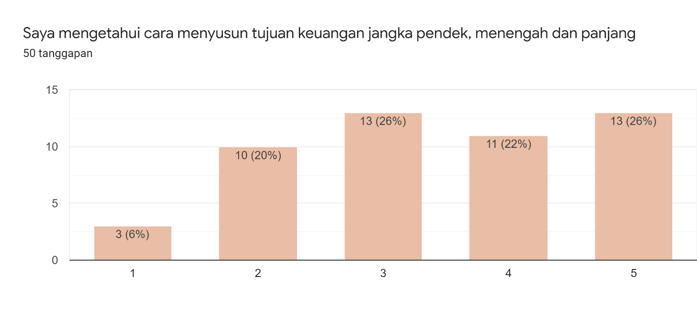
  
  
  
  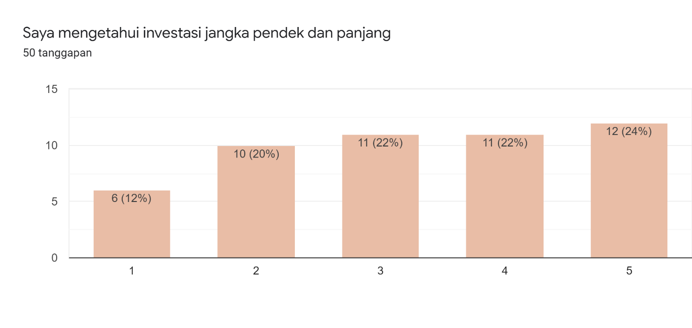
  
  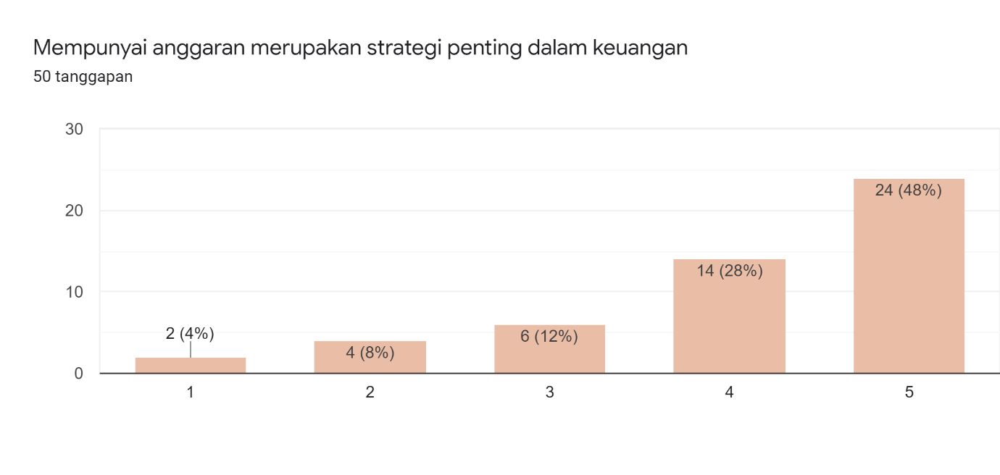
  
  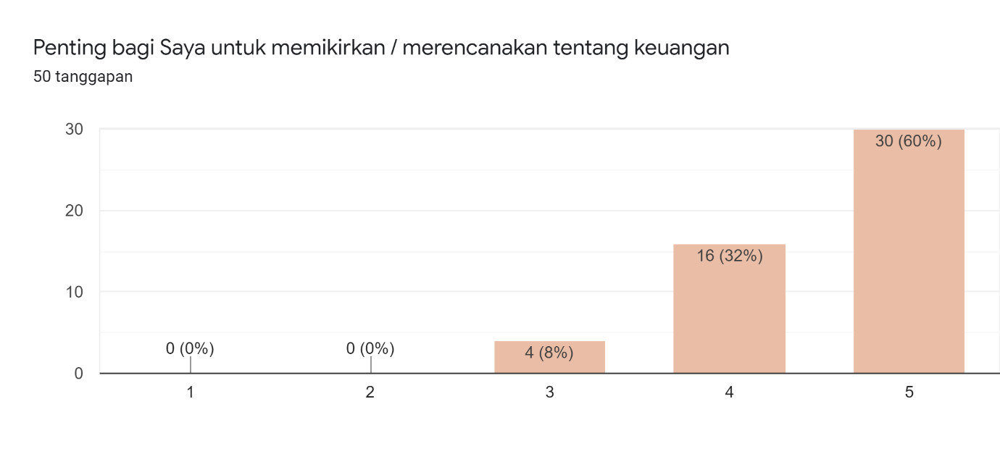
  
  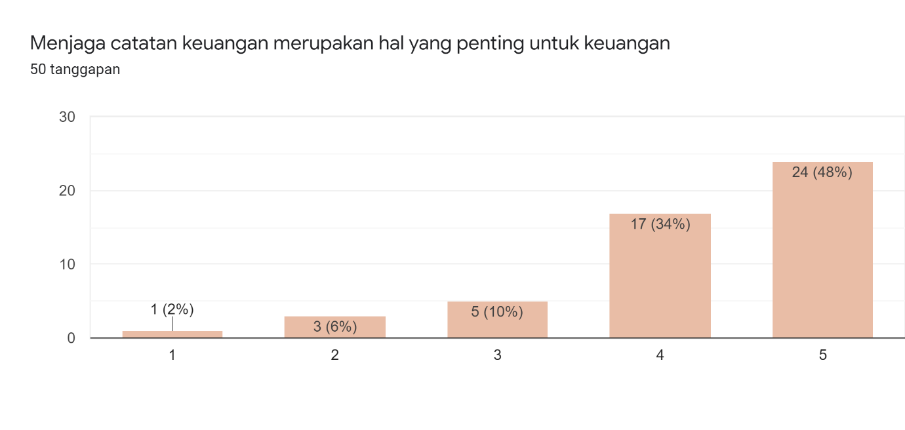
  
  
  
  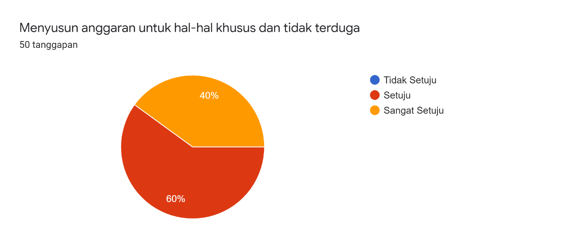
  
  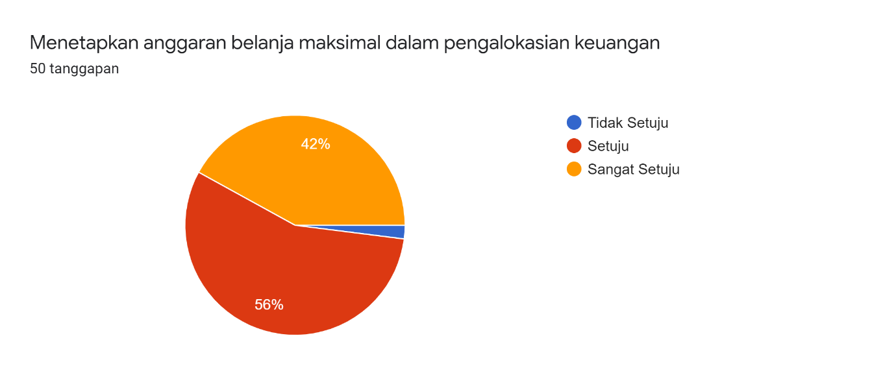
  
  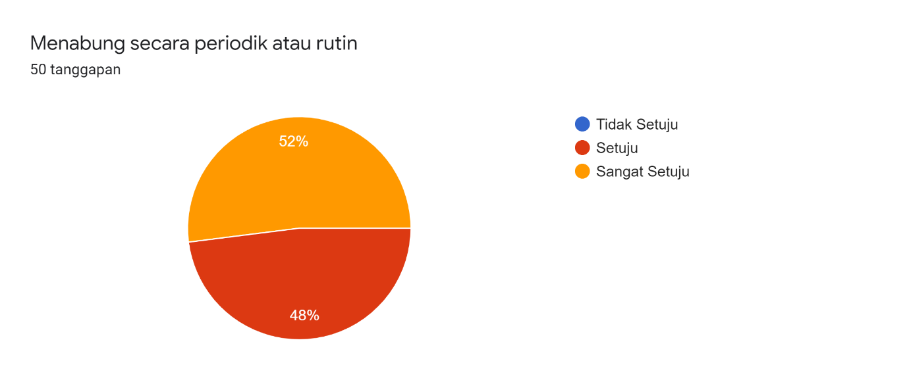
  
  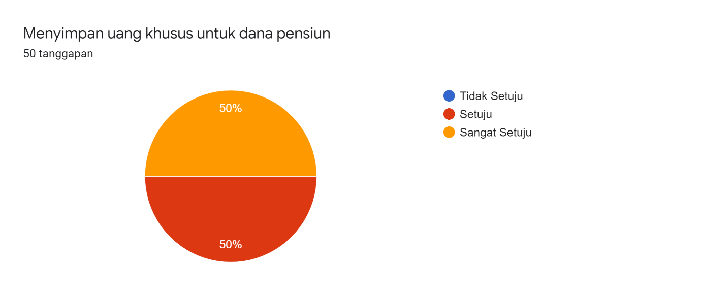
  
  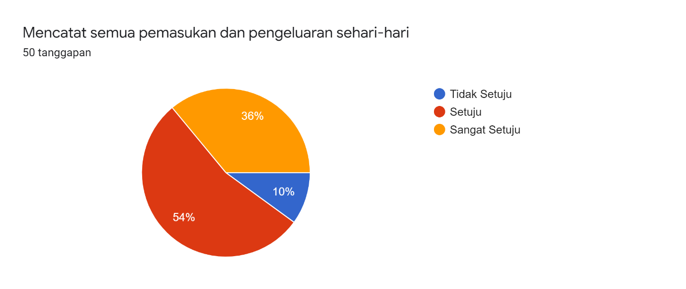
  
  ### Diagram Penggunaan kasus
  
  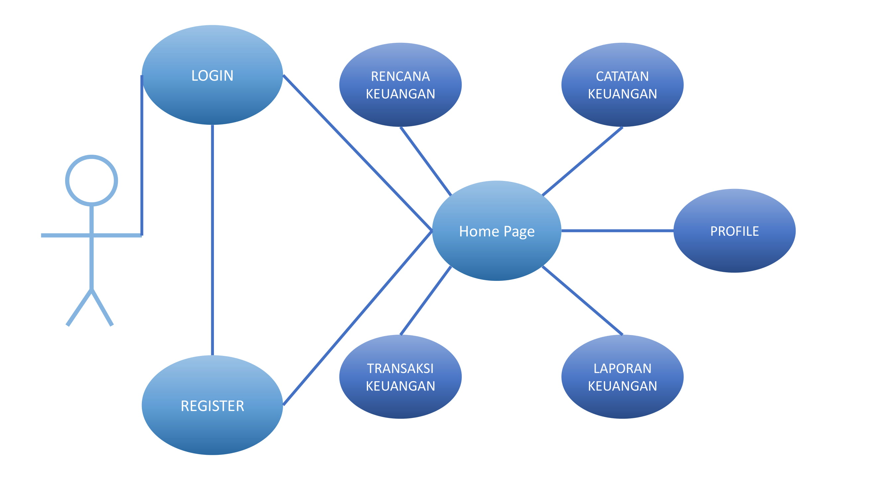
  
  ## Fitur Yang Direncanakan
  1. Mencatat Keuangan Pribadi  
  2. Merencanakan Keuangan Pribadi  
  3. Melihat Laporan Keuangan  
  4. Profil Keuangan Pribadi  
  
  ## Target Untuk Kedepannya
  1. Forum diskusi  
  2. Pengembangan UI
